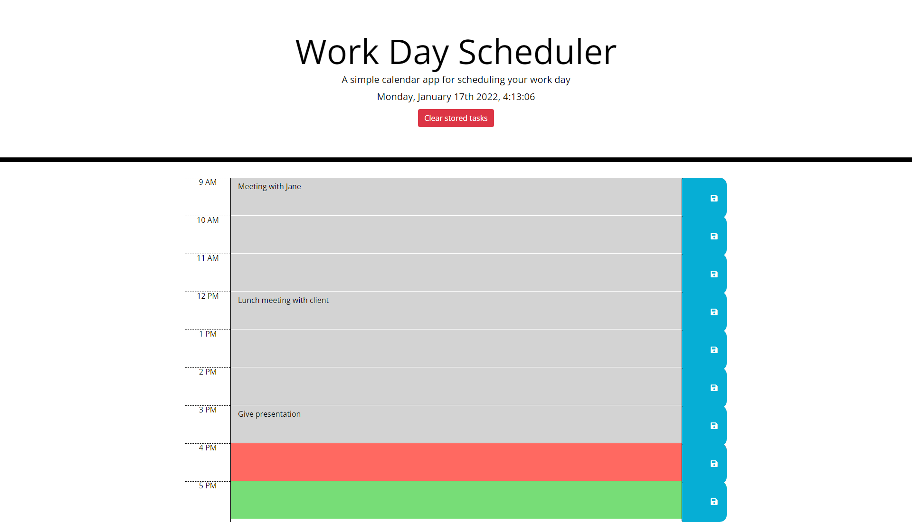

# 📔 Work Day Scheduler

A website made using HTML, CSS, Bootstrap, JS, Jquery & Moment JS with the purpose of letting the user plan out a work day from 9am to 5pm and save tasks written inside it.

# Features:

- The current time displayed at the top of the page
- Clear local tasks button to remove saved tasks from local storage
- Text fields and buttons to display the time from 9-5
- Updating colours of time blocks to display which time blocks are in the past, present or future.

# 📑 [Deployed Website](https://wratten.github.io/work-day-scheduler/)

